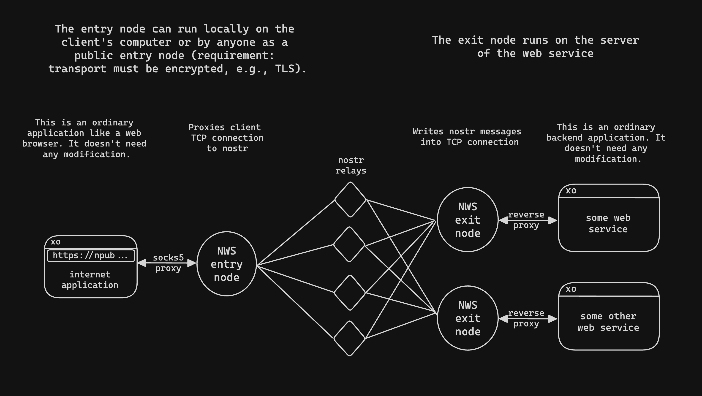

# Nostr Web Services (NWS)

NWS replaces the IP layer in TCP transport using Nostr, enabling secure connections between clients and backend services.

Exit node [domain names](#nws-domain-names) make private services accessible to entry nodes.

### Prerequisites

- A list of Nostr relays that the exit node is connected to.
- The Nostr private key of the exit node.

## Overview

### NWS main components

1. **Exit node**: A TCP reverse proxy that listens for incoming Nostr subscriptions and forwards the payload to your designated backend service.
2. **Entry node**: Forwards TCP packets to the exit node using a SOCKS proxy and creates encrypted events for the exit node.



### NWS domain names

There are two types of domain names resolved by NWS entry nodes:
1. `.nostr` domains, which have base32 encoded public key hostnames and base32 encoded relays as subdomains.
2. [nprofiles](https://nostr-nips.com/nip-19), which are combinations of a Nostr public key and multiple relays.

Both types of domains will be generated and printed in the console on startup

## Quickstart

Using Docker to run NWS is recommended. For instructions on running NWS on your local machine, refer to the [Build from source](#build-from-source) section.

### Using Docker-Compose

Navigate to the `docker-compose.yaml` file and set `NOSTR_PRIVATE_KEY` to your private key. Leaving it empty will generate a new private key upon startup.

To set up using Docker Compose, run the following command:
```bash
docker compose up -d --build
```

This will start an example environment, including:
- Entry node
- Exit node
- Exit node with HTTPS reverse proxy
- [Cashu Nutshell](https://github.com/cashubtc/nutshell) (backend service)
- [nostr-relay](https://github.com/scsibug/nostr-rs-relay)

You can run the following commands to receive your NWS domain:

```bash
docker logs exit-https 2>&1 | awk -F'domain=' '{if ($2) print $2}' | awk '{print $1}'
```

```bash
docker logs exit 2>&1 | awk -F'domain=' '{if ($2) print $2}' | awk '{print $1}'
```

### Sending requests to the entry node

With the log information from the previous step, you can use the following command to send a request to the exit node domain:

```bash
curl -v -x socks5h://localhost:8882 http://"$(docker logs exit 2>&1 | awk -F'domain=' '{if ($2) print $2}' | awk '{print $1}' | tail -n 1)"/v1/info --insecure
```

If the exit node supports TLS, you can choose to connect using the HTTPS scheme:

```bash
curl -v -x socks5h://localhost:8882 https://"$(docker logs exit-https 2>&1 | awk -F'domain=' '{if ($2) print $2}' | awk '{print $1}' | tail -n 1)"/v1/info --insecure
```

When using HTTPS, the entry node can be used as a service, as the operator will not be able to see the request data.

## Build from Source

To make your services reachable via Nostr, set up the exit node.

### Exit node

Configuration can be completed using environment variables. Alternatively, you can create a `.env` file in the current working directory with the following content:

```
NOSTR_RELAYS='ws://localhost:6666;wss://relay.domain.com'
NOSTR_PRIVATE_KEY="EXITPRIVATEHEX"
BACKEND_HOST='localhost:3338'
PUBLIC=false
```

- `NOSTR_RELAYS`: A list of Nostr relays to publish events to. Used only if there is no relay data in the request.
- `NOSTR_PRIVATE_KEY`: The private key to sign the events.
- `BACKEND_HOST`: The host of the backend to forward requests to.
- `PUBLIC`: If set to true, the exit node will announce itself on the Nostr network, enabling other entry nodes to discover it for public internet traffic relaying.

To start the exit node, use this command:

```bash
go run cmd/exit/exit.go
```

If your backend services support TLS, your service can now start using TLS encryption through a publicly available entry node.

---

### Entry node

To run an entry node for accessing NWS services behind exit nodes, use the following command:

```bash
go run cmd/entry/main.go
```

If you don't want to use the `PUBLIC_ADDRESS` feature, no further configuration is needed.

```
PUBLIC_ADDRESS='<public_ip>:<port>'
```

- `PUBLIC_ADDRESS`: This can be set if the entry node is publicly available. When set, the entry node will additionally bind to this address. Exit node discovery will still be done using Nostr. Once a connection is established, this public address will be used to transmit further data.
- `NOSTR_RELAYS`: A list of Nostr relays to publish events to. Used only if there is no relay data in the request.
